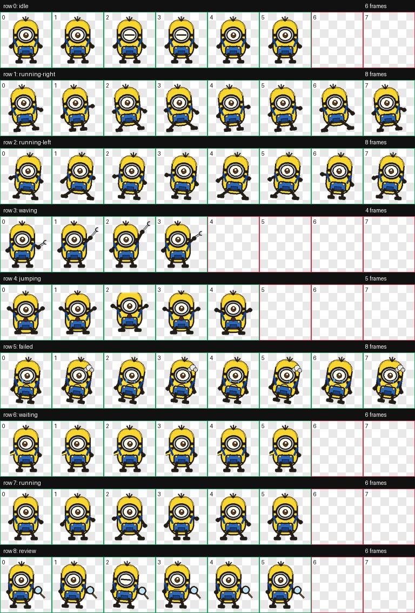

# Yellow Helper Codex Pet

Yellow Helper is a custom Codex desktop pet: a tiny yellow, one-goggle helper with blue overalls, a banana, a wrench, a magnifier, and a few expressive state animations.



## Install

Copy the pet folder into your Codex pets directory:

```powershell
Copy-Item -Recurse -Force .\pet\yellow-helper D:\codex-home\pets\yellow-helper
```

Restart Codex if it was already open, then select `Yellow Helper` from the pet list.

## Package Layout

```text
pet/yellow-helper/
  pet.json
  spritesheet.webp
```

The spritesheet follows the Codex pet atlas contract:

- Size: `1536x1872`
- Grid: `8` columns x `9` rows
- Cell size: `192x208`
- Background: transparent

Animation rows:

1. `idle`
2. `running-right`
3. `running-left`
4. `waving`
5. `jumping`
6. `failed`
7. `waiting`
8. `running`
9. `review`

## Regenerate

The asset is deterministic and generated with Pillow:

```powershell
python .\tools\generate_yellow_helper_pet.py --out-dir .\pet\yellow-helper
```

This rewrites `pet.json` and `spritesheet.webp`.

## Notes

This is an unofficial, fan-made Codex custom pet. It is a small original mascot inspired by yellow helper characters rather than an exact copy of any official character.

## License

MIT License. See [LICENSE](LICENSE).
